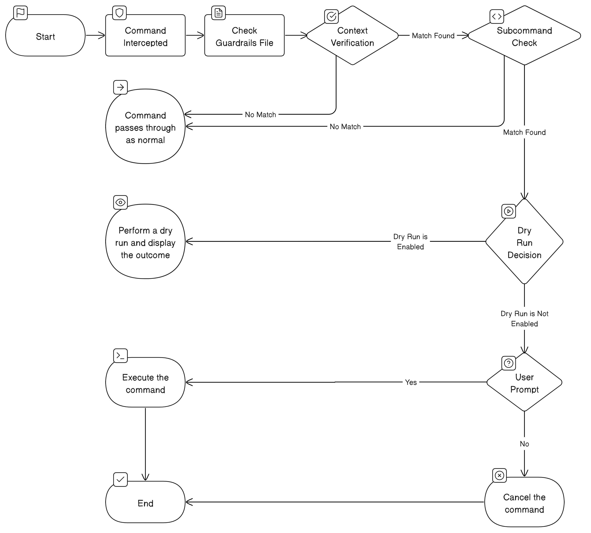

# kubectl-guardrails

As developers, we often find ourselves rapidly executing `kubectl`` commands, sometimes overlooking the crucial detail of the context in use. On occasion, this oversight leads to the alarming realization that we've been operating in the production cluster – a situation ripe for unwelcome surprises. Hello bad day...

This is where `kubectl guardrails` comes into play. Designed with a focus on safeguarding critical environments, `kubectl guardrails` empowers developers to establish protective measures around the contexts and subcommands that matter most. Its purpose is twofold: to provide an uninterrupted workflow for routine commands and to introduce a critical checkpoint for potentially hazardous operations.

For instance, encountering a yes/no prompt for a simple `get pods` command can disrupt your workflow. However, the ability to enforce a confirmation step before executing a `delete <resource>` command in a sensitive context like production is invaluable. It's a strategic balance between maintaining efficiency and preventing the kind of accidents that turn an ordinary day into a nightmare.

## Workflow

<p align="center" width="100%">
  <picture>
    <source media="(prefers-color-scheme: dark)" srcset="./docs/kubectl-guardrails-workflow-dark.png">
    
  </picture>
</p>

## Example

```console
❯ kubectl delete pods hello
================ Context ==================

Current Context: Prod-Cluster

================ Dry Run ==================

pod "hello" deleted (dry run)

===========================================

Would you like to proceed? (y/N): y

❯ kubectl delete pods hello

pod "hello" deleted
```

## Install

1. Download the latest [release](https://github.com/theelderbeever/kubectl-guardrails/releases) to a place on your path OR `cargo install --git https://github.com/theelderbeever/kubectl-guardrails.git`
2. Create your `~/.kube/guardrails` file as shown in the Configuration section.
3. (Optional) In your `.bashrc`/`.zshrc` add `alias "kubectl=kubectl guardrails"`

## Configuration

```yaml
contexts:
  - name: Prod-Cluster # This should match a context in your `KUBECONFIG` file
    prompts:
      - name: apply
      - name: delete
        dry-run: true
```

## Opening in Codespaces

1. On the GitHub repository page, click the `Code` button.
2. In the drop-down menu, select `Open with Codespaces`.
3. Click `New codespace` to create a new Codespace environment.

## Working in the Dev Container

Once the Codespace is created, you will be inside the `devcontainer` environment. This environment is pre-configured with all the necessary dependencies and tools required for the project.

- **Development Container**: The workspace includes a development container which encapsulates all necessary dependencies and configurations. This ensures a consistent development environment across different machines.
- **Kubernetes Cluster (kind)**: A local Kubernetes cluster is set up using `kind` (Kubernetes in Docker) for testing and development purposes. This allows you to deploy and test your applications in a containerized environment.

### Exposing Kubernetes Apps

To expose a Kubernetes application (e.g., a pod named hello) on your local machine, use the kubectl port-forward command. This allows you to access the app via a specified port on your localhost. The following command forwards port 8080 on your local machine to port 8080 of the hello pod:

```bash
kubectl port-forward hello 8080
```
